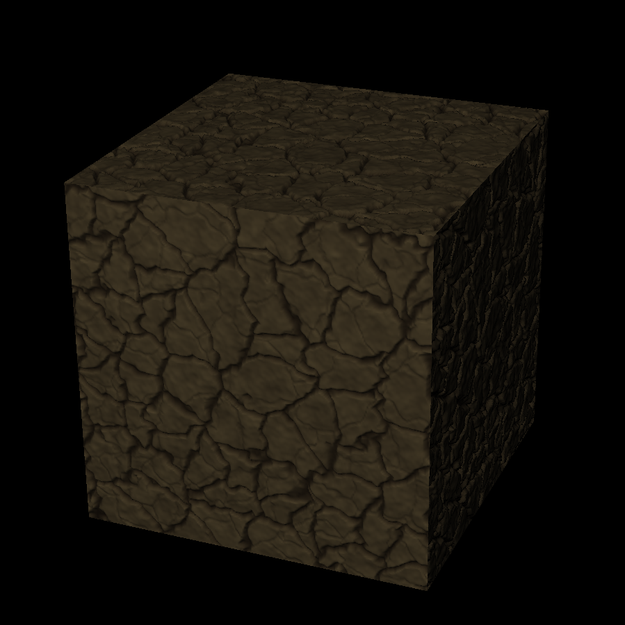
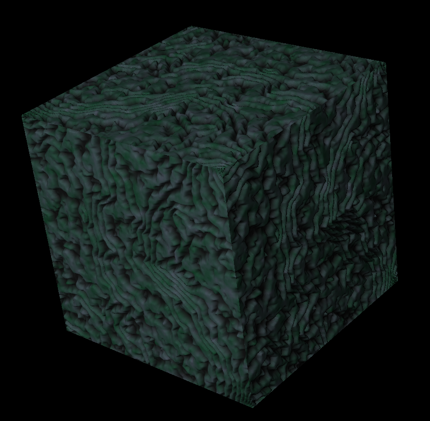

# TexGen
A simple tool for procedural texture generation, using various noise techniques.

Copyright (C) 2016 Erik Boström.

This application has the following dependencies:

  - Eigen3
    http://eigen.tuxfamily.org/index.php?title=Main_Page
  - SDL2
    http://www.libsdl.org/
  - Horde3d
    http://www.horde3d.org/
  - Squirrel3
    http://www.squirrel-lang.org/

These libraries are included as code in the project repository. The reason for this is that the libraries used have some slight modifications. In particular SDL2 has a bug in it's Wayland support which has been reported, but not yet pushed to the release branch. Horde3d and squirrel also has some added features.

## Examples

## Building
Just run make. Currently works only on Linux. Requires gcc 4.8, make and cmake 2.6.

Please excuse the build-system, it's a quickly thrown together mess of makefiles. Has been tested on Manjaro and Ubuntu.

## Instructions
Build and run the application (it's created in bin/release). An black screen with a cube should appear. Esc exits. Hit ctrl+tab to bring up the squirrel REPL.

The application is controlled through a simple imperative squirrel API, for a description of it see the manual. At start up the application runs the script in the file 'init.nut'. The application already has some presets that can be viewed by running the command 'loadPreset(preset, seed)' where 'preset' is the number of the preset (currently only 1, 2), and 'seed' is a seed to the random generator (an integer or a string). The model in the viewer can be rotated by clicking the left mouse button and dragging, the light source can be rotated by clicking and dragging the right mouse button. Plus and minus on the number pad zooms in and out.

To save the generated textures (only bmp format currently supported) type "saveBMP(tex, "filename.bmp")" where tex is col\_tex for color map, and norm\_tex for normal map (with height map in alpha channel).

It uses the Horde3d rendering system, so shaders are specified in Horde3ds übershader-like language based on glsl. The shaders are loaded in scripts so they can be easily changed to allow for seeing the textures rendered with any shading technique.

Features:
  - Full squirrel support.
  - Blending, warping, filtering implemented in C++ with multi-threading for high performance.
  - Blur and sharpen filters.
  - Perlin noise, Cell noise.
  - Generation of Delaunay triangulation and Voronoi diagrams.
  - Normal map generation.
  - A flexible rendering system supporting user defined shaders. Default shader implements parallax mapping.
  - Saving of textures in bmp format.
  - Support for different geometry models in Horde3ds \*.geo format, or procedurally generated through squirrel scripts.

Planned features:
  - Cross platform buils through CMake.
  - GUI
  - Running the application from command line withough viewer.
  - Simplification of API (In progress).
  - Integration with squirrels reference counting system for memory management (In progress).
  - Performance tuning.

This project is not in particularly active development, so these features might take some time.

Have a look through the examples and the manual to get a hang of what the application can do. More docs to be written in the future.
